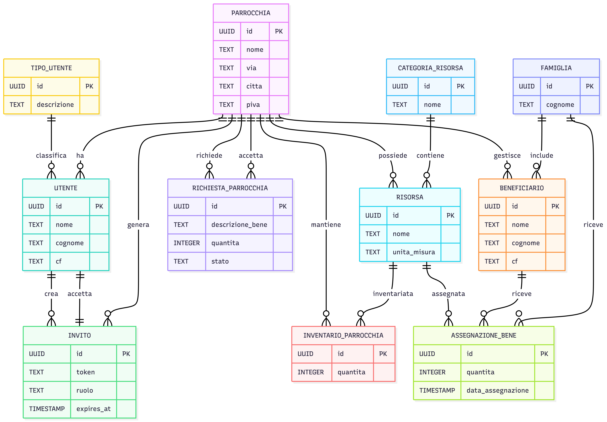

# Documentazione Database - KARIS

## Indice
1. [Introduzione](#introduzione)
2. [Schema Logico](#schema-logico)
3. [Diagramma Entità-Relazione](#diagramma-entità-relazione)
4. [Relazioni](#relazioni)
5. [Vincoli e Regole di Business](#vincoli-e-regole-di-business)

---

## Introduzione

Il database **KARIS** è progettato per gestire la distribuzione di beni e risorse tra parrocchie, beneficiari e famiglie. Il sistema supporta la gestione di inventari, assegnazioni, richieste e inviti per utenti con diversi ruoli.

**Tecnologia**: PostgreSQL  
**Encoding**: UTF-8  
**Tipi di dati**: Utilizzo di UUID per le chiavi primarie

---

## Schema Logico

### 1. **parrocchia**
Rappresenta le parrocchie che utilizzano il sistema.

| Campo | Tipo | Vincoli | Descrizione |
|-------|------|---------|-------------|
| `id` | UUID | PRIMARY KEY, DEFAULT uuid_generate_v4() | Identificatore univoco |
| `nome` | TEXT | NOT NULL | Nome della parrocchia |
| `via` | TEXT | NULL | Indirizzo |
| `citta` | TEXT | NULL | Città |
| `piva` | TEXT | NULL | Partita IVA |
| `created_at` | TIMESTAMP WITH TIME ZONE | DEFAULT now() | Data di creazione |

### 2. **utente**
Rappresenta gli utenti del sistema (amministratori e volontari).

| Campo | Tipo | Vincoli | Descrizione |
|-------|------|---------|-------------|
| `id` | UUID | PRIMARY KEY, DEFAULT uuid_generate_v4() | Identificatore univoco |
| `nome` | TEXT | NOT NULL | Nome dell'utente |
| `cognome` | TEXT | NOT NULL | Cognome dell'utente |
| `cf` | TEXT | UNIQUE | Codice fiscale |
| `tipo_utente_id` | UUID | FOREIGN KEY → tipo_utente(id) | Tipo di utente |
| `parrocchia_id` | UUID | FOREIGN KEY → parrocchia(id) | Parrocchia di appartenenza |
| `created_at` | TIMESTAMP WITH TIME ZONE | DEFAULT now() | Data di creazione |

### 3. **tipo_utente**
Definisce i tipi di utente disponibili nel sistema.

| Campo | Tipo | Vincoli | Descrizione |
|-------|------|---------|-------------|
| `id` | UUID | PRIMARY KEY, DEFAULT uuid_generate_v4() | Identificatore univoco |
| `descrizione` | TEXT | NOT NULL | Descrizione del tipo (es. "Amministratore", "Volontario") |

### 4. **beneficiario**
Rappresenta le persone che ricevono aiuti dalla parrocchia.

| Campo | Tipo | Vincoli | Descrizione |
|-------|------|---------|-------------|
| `id` | UUID | PRIMARY KEY, DEFAULT uuid_generate_v4() | Identificatore univoco |
| `nome` | TEXT | NOT NULL | Nome del beneficiario |
| `cognome` | TEXT | NOT NULL | Cognome del beneficiario |
| `cf` | TEXT | UNIQUE | Codice fiscale |
| `data_nascita` | DATE | NULL | Data di nascita |
| `luogo_nascita` | TEXT | NULL | Luogo di nascita |
| `famiglia_id` | UUID | FOREIGN KEY → famiglia(id) | Famiglia di appartenenza |
| `parrocchia_id` | UUID | FOREIGN KEY → parrocchia(id) | Parrocchia di riferimento |
| `created_at` | TIMESTAMP WITH TIME ZONE | DEFAULT now() | Data di creazione |

### 5. **famiglia**
Rappresenta le famiglie dei beneficiari.

| Campo | Tipo | Vincoli | Descrizione |
|-------|------|---------|-------------|
| `id` | UUID | PRIMARY KEY, DEFAULT uuid_generate_v4() | Identificatore univoco |
| `cognome` | TEXT | NOT NULL | Cognome della famiglia |
| `note` | TEXT | NULL | Note aggiuntive |

### 6. **risorsa**
Rappresenta i beni/risorse disponibili nel sistema.

| Campo | Tipo | Vincoli | Descrizione |
|-------|------|---------|-------------|
| `id` | UUID | PRIMARY KEY, DEFAULT uuid_generate_v4() | Identificatore univoco |
| `nome` | TEXT | NOT NULL | Nome della risorsa |
| `descrizione` | TEXT | NULL | Descrizione dettagliata |
| `unita_misura` | TEXT | DEFAULT 'pz' | Unità di misura (es. "pz", "kg", "L") |
| `parrocchia_id` | UUID | FOREIGN KEY → parrocchia(id) | Parrocchia proprietaria |
| `categoria_id` | UUID | FOREIGN KEY → categoria_risorsa(id) | Categoria della risorsa |

### 7. **categoria_risorsa**
Definisce le categorie delle risorse (es. "Alimentari", "Igiene personale").

| Campo | Tipo | Vincoli | Descrizione |
|-------|------|---------|-------------|
| `id` | UUID | PRIMARY KEY, DEFAULT uuid_generate_v4() | Identificatore univoco |
| `nome` | TEXT | NOT NULL | Nome della categoria |

### 8. **inventario_parrocchia**
Gestisce le quantità di risorse disponibili per ogni parrocchia.

| Campo | Tipo | Vincoli | Descrizione |
|-------|------|---------|-------------|
| `id` | UUID | PRIMARY KEY, DEFAULT uuid_generate_v4() | Identificatore univoco |
| `parrocchia_id` | UUID | FOREIGN KEY → parrocchia(id) | Parrocchia |
| `risorsa_id` | UUID | FOREIGN KEY → risorsa(id) | Risorsa |
| `quantita` | INTEGER | DEFAULT 0 | Quantità disponibile |
| `updated_at` | TIMESTAMP WITH TIME ZONE | DEFAULT now() | Data ultimo aggiornamento |

### 9. **assegnazione_bene**
Registra le assegnazioni di beni a beneficiari o famiglie.

| Campo | Tipo | Vincoli | Descrizione |
|-------|------|---------|-------------|
| `id` | UUID | PRIMARY KEY, DEFAULT uuid_generate_v4() | Identificatore univoco |
| `risorsa_id` | UUID | NOT NULL, FOREIGN KEY → risorsa(id) | Risorsa assegnata |
| `beneficiario_id` | UUID | FOREIGN KEY → beneficiario(id) | Beneficiario (se assegnazione individuale) |
| `famiglia_id` | UUID | FOREIGN KEY → famiglia(id) | Famiglia (se assegnazione familiare) |
| `quantita` | INTEGER | NOT NULL | Quantità assegnata |
| `data_assegnazione` | TIMESTAMP WITH TIME ZONE | DEFAULT now() | Data di assegnazione |
| `note` | TEXT | NULL | Note aggiuntive |

**Vincolo**: Un'assegnazione deve essere riferita O a un beneficiario O a una famiglia, ma non a entrambi.

### 10. **richiesta_parrocchia**
Gestisce le richieste di beni tra parrocchie.

| Campo | Tipo | Vincoli | Descrizione |
|-------|------|---------|-------------|
| `id` | UUID | PRIMARY KEY, DEFAULT uuid_generate_v4() | Identificatore univoco |
| `parrocchia_richiedente_id` | UUID | NOT NULL, FOREIGN KEY → parrocchia(id) | Parrocchia che richiede |
| `descrizione_bene` | TEXT | NOT NULL | Descrizione del bene richiesto |
| `quantita` | INTEGER | NOT NULL | Quantità richiesta |
| `unita_misura` | TEXT | DEFAULT 'pz' | Unità di misura |
| `messaggio` | TEXT | NULL | Messaggio opzionale |
| `stato` | TEXT | DEFAULT 'pending', CHECK (pending/accepted/rejected) | Stato della richiesta |
| `parrocchia_accettante_id` | UUID | FOREIGN KEY → parrocchia(id) | Parrocchia che accetta (se accettata) |
| `created_at` | TIMESTAMP WITH TIME ZONE | DEFAULT now() | Data di creazione |
| `updated_at` | TIMESTAMP WITH TIME ZONE | DEFAULT now() | Data ultimo aggiornamento |

### 11. **invito**
Gestisce gli inviti per nuovi utenti del sistema.

| Campo | Tipo | Vincoli | Descrizione |
|-------|------|---------|-------------|
| `id` | UUID | PRIMARY KEY, DEFAULT uuid_generate_v4() | Identificatore univoco |
| `token` | TEXT | NOT NULL, UNIQUE | Token univoco per l'invito |
| `parrocchia_id` | UUID | NOT NULL, FOREIGN KEY → parrocchia(id) | Parrocchia per cui è valido l'invito |
| `ruolo` | TEXT | NOT NULL, DEFAULT 'volontario', CHECK (volontario/amministratore) | Ruolo assegnato |
| `created_by` | UUID | NOT NULL, FOREIGN KEY → utente(id) | Utente che ha creato l'invito |
| `created_at` | TIMESTAMP WITH TIME ZONE | NOT NULL, DEFAULT now() | Data di creazione |
| `expires_at` | TIMESTAMP WITH TIME ZONE | NOT NULL, DEFAULT (now() + 7 days) | Data di scadenza |
| `accepted_at` | TIMESTAMP WITH TIME ZONE | NULL | Data di accettazione |
| `accepted_by` | UUID | UNIQUE, FOREIGN KEY → utente(id) | Utente che ha accettato l'invito |
| `revoked_at` | TIMESTAMP WITH TIME ZONE | NULL | Data di revoca |

---

## Diagramma Entità-Relazione

Il seguente diagramma mostra la struttura completa del database KARIS con tutte le entità e le loro relazioni:

---

## Relazioni

### Relazioni Principali

1. **parrocchia ↔ utente** (1:N)
   - Una parrocchia può avere più utenti
   - Un utente appartiene a una sola parrocchia

2. **parrocchia ↔ beneficiario** (1:N)
   - Una parrocchia può avere più beneficiari
   - Un beneficiario appartiene a una sola parrocchia

3. **parrocchia ↔ risorsa** (1:N)
   - Una parrocchia può avere più risorse
   - Una risorsa appartiene a una sola parrocchia

4. **parrocchia ↔ invito** (1:N)
   - Una parrocchia può avere più inviti
   - Un invito è valido per una sola parrocchia

5. **parrocchia ↔ richiesta_parrocchia** (1:N come richiedente, N:1 come accettante)
   - Una parrocchia può fare più richieste
   - Una parrocchia può accettare più richieste
   - Una richiesta è fatta da una parrocchia e può essere accettata da un'altra

6. **tipo_utente ↔ utente** (1:N)
   - Un tipo di utente può essere assegnato a più utenti
   - Un utente ha un solo tipo

7. **categoria_risorsa ↔ risorsa** (1:N)
   - Una categoria può contenere più risorse
   - Una risorsa appartiene a una sola categoria

8. **famiglia ↔ beneficiario** (1:N)
   - Una famiglia può avere più beneficiari
   - Un beneficiario appartiene a una sola famiglia

9. **risorsa ↔ inventario_parrocchia** (1:N)
   - Una risorsa può essere presente in più inventari
   - Un record di inventario si riferisce a una sola risorsa

10. **risorsa ↔ assegnazione_bene** (1:N)
    - Una risorsa può essere assegnata più volte
    - Un'assegnazione si riferisce a una sola risorsa

11. **beneficiario ↔ assegnazione_bene** (N:1, opzionale)
    - Un beneficiario può ricevere più assegnazioni
    - Un'assegnazione può essere riferita a un solo beneficiario (o a una famiglia)

12. **famiglia ↔ assegnazione_bene** (N:1, opzionale)
    - Una famiglia può ricevere più assegnazioni
    - Un'assegnazione può essere riferita a una sola famiglia (o a un beneficiario)

13. **utente ↔ invito** (1:N come creatore, N:1 come accettante)
    - Un utente può creare più inviti
    - Un utente può accettare un solo invito (vincolo UNIQUE su accepted_by)

---

## Vincoli e Regole di Business

### Vincoli di Integrità Referenziale

- Tutte le foreign key sono definite con vincoli di integrità referenziale
- Le chiavi primarie utilizzano UUID generati automaticamente

### Vincoli di Unicità

- `utente.cf`: UNIQUE
- `beneficiario.cf`: UNIQUE
- `invito.token`: UNIQUE
- `invito.accepted_by`: UNIQUE (un utente può accettare un solo invito)

### Vincoli CHECK

1. **invito.ruolo**: Deve essere 'volontario' o 'amministratore'
2. **richiesta_parrocchia.stato**: Deve essere 'pending', 'accepted' o 'rejected'

### Regole di Business

1. **Assegnazione beni**: Un'assegnazione deve essere riferita O a un beneficiario O a una famiglia, ma non a entrambi contemporaneamente (vincolo implementato tramite CHECK constraint).

2. **Inviti**: 
   - Gli inviti scadono dopo 7 giorni dalla creazione (default)
   - Un utente può accettare un solo invito (vincolo UNIQUE su accepted_by)
   - Gli inviti possono essere revocati (campo revoked_at)

3. **Richieste tra parrocchie**:
   - Lo stato iniziale è 'pending'
   - Quando accettata, viene specificata la parrocchia_accettante_id
   - Quando rifiutata, lo stato diventa 'rejected'

4. **Inventario**: 
   - La quantità può essere 0 o positiva
   - Ogni combinazione parrocchia-risorsa può avere un solo record di inventario

5. **Timestamp automatici**:
   - `created_at` viene impostato automaticamente alla creazione
   - `updated_at` viene aggiornato automaticamente per inventario_parrocchia e richiesta_parrocchia
